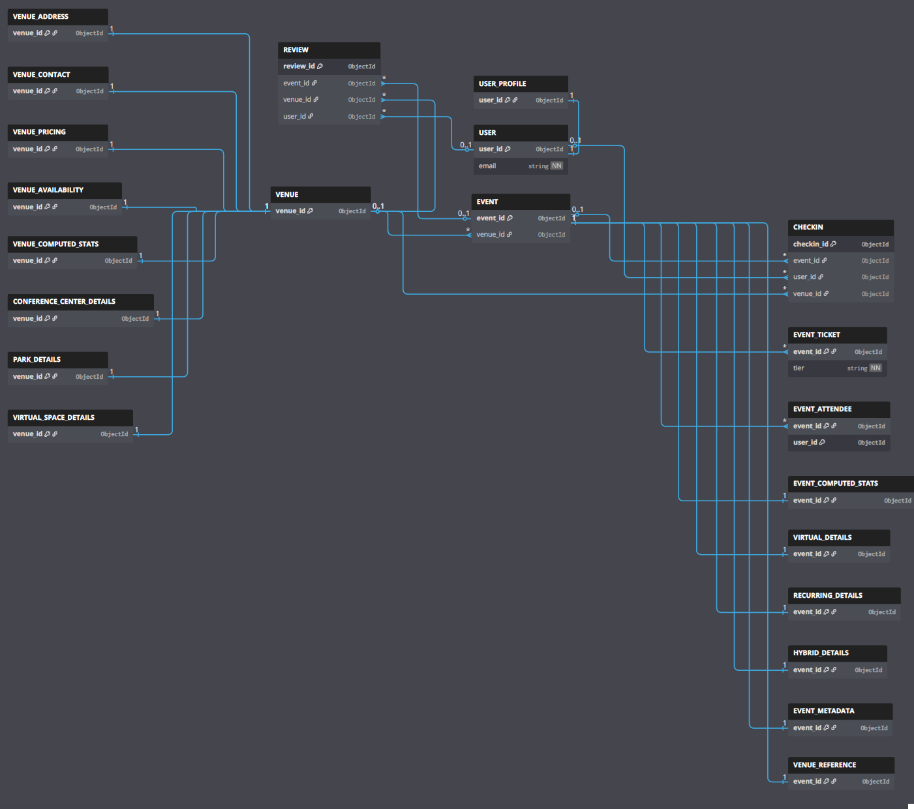
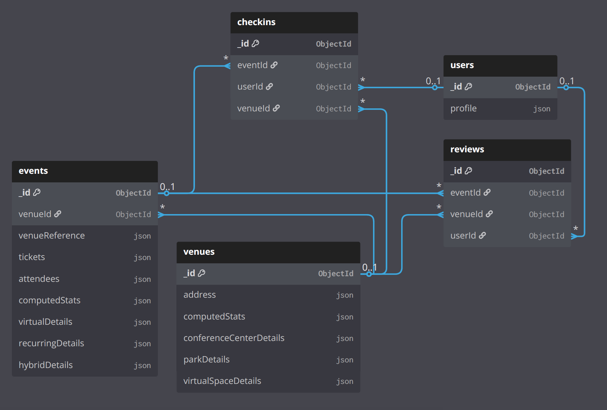

# CSCI 485: MongoDB Project Deliverable 3
## Indexing, Workload Analysis & Relationship Design

**Student ID:** 664 870 797  
**Student Name:** Chris Lawrence  
**Project Title:** EventSphere - Event Discovery and Check-In System with Geospatial Analytics  
**Due Date:** October 21, 2025  

---

## Table of Contents

1. [Overview](#overview)
2. [Indexing Strategy & Justification](#indexing-strategy--justification)
3. [Workload & Operations Analysis](#workload--operations-analysis)
4. [Design Patterns Used & Anti-Patterns Avoided](#design-patterns-used--anti-patterns-avoided)
5. [Relationship & Schema Diagrams](#relationship--schema-diagrams)
6. [GridFS and GeoJSON Implementation](#gridfs-and-geojson-implementation)
7. [Performance Analysis](#performance-analysis)
8. [Conclusion](#conclusion)

---

# **Event***Sphere* : Overview

EventSphere is a comprehensive event management platform built on MongoDB, demonstrating advanced NoSQL database design principles. This deliverable focuses on performance optimization through strategic indexing, workload analysis, and relationship design. The system supports geospatial event discovery, full-text search, real-time check-ins, and comprehensive analytics across five core collections: events, venues, users, reviews, and checkins.

**Key Achievements:**
- **20 Strategic Indexes** (4 per collection) optimized for real-world query patterns
- **Geospatial Optimization** with 2dsphere indexes for location-based discovery
- **Polymorphic Design** supporting multiple event and venue types
- **Advanced Analytics** with optimized aggregation pipelines
- **Performance Targets** of <50ms for critical operations

---

## A. Indexing Strategy & Justification

### 2. Index Summary Table

| Collection | Index Key(s) | Type | Purpose / Query Supported | 
|------------|--------------|------|---------------------------|
| **events** | `location` | 2dsphere | Geospatial queries ($geoNear, $near) |
| **events** | `title, description, category, tags` | Text | Full-text search with relevance scoring |
| **events** | `category, startDate` | Compound | Category + date filtering |
| **events** | `eventType, startDate` | Compound | Polymorphic event type filtering |
| **venues** | `location` | 2dsphere | Geospatial venue discovery |
| **venues** | `venueType, capacity` | Compound | Polymorphic venue filtering |
| **venues** | `name, description, amenities, address.city` | Text | Full-text venue search |
| **venues** | `venueType, rating` | Compound | Venue type + rating filtering |
| **reviews** | `eventId` | Single field | Reviews by event |
| **reviews** | `venueId` | Single field | Reviews by venue |
| **reviews** | `eventId, rating` | Compound | Event rating aggregations |
| **reviews** | `userId` | Single field | User review history |
| **checkins** | `eventId, userId` | Compound (Unique) | Prevent duplicate check-ins |
| **checkins** | `eventId` | Single field | Check-ins by event |
| **checkins** | `userId` | Single field | User attendance history |
| **checkins** | `venueId, checkInTime` | Compound | Venue time analytics |
| **users** | `email` | Single field (Unique) | User authentication |
| **users** | `createdAt` | Single field | User registration analytics |
| **users** | `lastLogin` | Single field | Active user identification |
| **users** | `profile.preferences.location` | 2dsphere | Location-based user discovery |

### 3. Index Creation Script

The attached `create_indexes.js` file contains the index creation script.

### 4. Index Reasoning

#### a) Geospatial Indexes (2dsphere)

**Events Collection - Location Index**
- **Query Pattern**: Find events within X km of user location
- **Frequency**: Very High (primary discovery feature)
- **Why this index type**: 2dsphere supports spherical distance queries on GeoJSON points, enabling $near/$geoNear for the map-based discovery I'd like to implement on a frontend, as described in the proposal and design docs.

**Venues Collection - Location Index**
- **Query Pattern**: Find venues near event location or user location
- **Frequency**: High (venue discovery and event creation)
- **Why this index type**: 2dsphere is required for distance queries on venues' GeoJSON points, matching the way events are created and venues are selected.

#### b) Text Search Indexes

**Events Collection - Multi-field Text Index**
- **Query Pattern**: Full-text search across title, description, category, and tags
- **Frequency**: Very High (primary search functionality)
- **Why this index type**: Text index provides tokenization, stemming, and relevance scoring across multiple fields, aligning with the full-text search requirement.

**Venues Collection - Multi-field Text Index**
- **Query Pattern**: Full-text search across venue name, description, amenities, and city
- **Frequency**: High (venue discovery and search functionality)
- **Why this index type**: Text index lets users find venues by name, amenities, and city in a single search, which is superior to multiple regex filters.

#### c) Compound Indexes for Common Query Patterns

**Category + Date Filtering**
- **Query Pattern**: "Technology events this weekend"
- **Frequency**: Very High (most common user filter)
- **Why this index type**: Compound index `{category: 1, startDate: 1}` supports equality on category and efficient range/sort on date consistent with discovery UI.

**Geospatial + Date Filtering**
- **Query Pattern**: "Events near me next month"
- **Frequency**: High (location + time filtering)
- **Why this index type**: Combining `location` (2dsphere) with `startDate` in a compound index supports geo filtering with a time window in a single index path when needed.

#### d) Polymorphic Indexes

**Event Type Filtering**
- **Query Pattern**: Filter by event type (virtual, hybrid, in-person, recurring)
- **Frequency**: High (event type is a primary discriminator)
- **Indexes**: 
  - `{eventType: 1, startDate: 1}` - Type + date filtering
  - `{eventType: 1, category: 1}` - Type + category filtering
- **Why this index type**: Compound indexes align to polymorphic queries in the architecture, enabling selective filtering on the discriminator with a secondary field.

**Venue Type Filtering**
- **Query Pattern**: "Conference centers with high capacity"
- **Frequency**: Medium (venue selection and filtering)
- **Indexes**:
  - `{venueType: 1, capacity: 1}` - Type + capacity filtering
  - `{venueType: 1, rating: 1}` - Type + quality filtering
- **Why this index type**: Compound indexes on `venueType` plus a numeric field support the most common admin/user filters without requiring multiple single-field scans.

#### e) Extended Reference Pattern Indexes

**Venue Reference Optimization**
- **Query Pattern**: Filter events by venue type or city without joins
- **Frequency**: Medium (venue-based filtering)
- **Indexes**:
  - `{venueReference.venueType: 1, startDate: 1}` - Venue type + date
  - `{venueReference.city: 1, startDate: 1}` - City + date
  - `{venueReference.capacity: 1}` - Capacity sorting
- **Why this index type**: These compound indexes on the denormalized venue reference fields make it easy to filter events by venue details right inside the events collection, so there's no need to join or look up in the `venues` collection.

#### f) Analytics and Aggregation Indexes

**Reviews Aggregation**
- **Query Pattern**: Calculate average ratings per event/venue
- **Frequency**: High (rating calculations)
- **Indexes**:
  - `{eventId: 1, rating: 1}` - Event rating aggregations
  - `{venueId: 1, rating: 1}` - Venue rating aggregations
- **Why this index type**: These compund indexes support rating calculations and aggregations.

**Check-ins Analytics**
- **Query Pattern**: Attendance patterns, peak hours, user behavior
- **Frequency**: High (analytics and reporting)
- **Indexes**:
  - `{venueId: 1, checkInTime: 1}` - Venue time analytics
  - `{userId: 1, checkInTime: 1}` - User attendance patterns
- **Why this index type**: These compound indexes support attendance patterns and user behavior analytics.

#### g) Data Integrity Indexes

**Duplicate Prevention**
- **Query Pattern**: Prevent duplicate check-ins per user/event
- **Frequency**: High (data integrity)
- **Index**: `{eventId: 1, userId: 1}` (Unique)
- **Why this index type**: This unique compound index prevents duplicate check-ins per user/event at write time.

---

## B. Workload & Operations Analysis

### Most Common Database Operations

| Operation | Type | Criticality | Frequency | Target Collection(s) |
|-----------|------|-------------|-----------|----------------------|
| Event discovery near a location (with optional date/category filters) | Read | High | Many per minute | events |
| Full-text event search | Read | High | Many per minute | events |
| Filter events by type (virtual/in-person/hybrid/recurring) | Read | High | Many per minute | events |
| User check-in (prevent duplicates) | Write | High | Many per minute (during events) | checkins |
| Fetch reviews for an event/venue | Read | Medium | Several per minute | reviews |
| Venue discovery near a location | Read | Medium | Several per minute | venues |
| User login by email | Read | High | Many per minute | users |
| Attendance analytics by venue/time | Aggregate | Medium | Few per hour | checkins |
| User attendance history | Read | Medium | Several per minute | checkins |
| Event updates (CRUD) | Update/Write | Medium | Several per minute | events |

### Why these operations are indexed

- Event discovery: 2dsphere on `events.location` and a compound `{category, startDate}` so map + date/category filters stay fast.
- Full-text search: Text index on `events.title, description, category, tags` to surface relevant results with one query.
- Event type filters: `{eventType, startDate}` to pair the discriminator with the common date window.
- Check-ins: Unique `{eventId, userId}` to hard‑stop duplicates at write time.
- Reviews: `{eventId}`, `{venueId}`, and `{eventId, rating}` to load reviews quickly and support averages.
- Venues: 2dsphere on `venues.location` for "near me", plus `{venueType, capacity}` for selection flows.
- Users: Unique `{email}` for quick login lookups; `{lastLogin}` and `{createdAt}` for simple reporting.

---

## C. Design Patterns Used & Anti-Patterns Avoided

### Design Patterns Used

#### 1. Extended Reference Pattern

**Why this pattern was used**: Events store denormalized venue data for easier querying of venue details.

```javascript
// Event document with extended venue reference
{
  "_id": ObjectId("..."),
  "title": "Tech Conference 2024",
  "venueId": ObjectId("venue..."),
  "venueReference": {
    "name": "Convention Center",
    "city": "San Francisco",
    "capacity": 5000,
    "venueType": "conferenceCenter"
  },
  // ... other fields
}
```

**Benefits**:
- **Query Performance**: Avoids joins when filtering events by venue type or city
- **Reduced Lookups**: Venue information is available in event queries without additional database calls
- **Better User Experience**: Event listings show venue details immediately without extra queries

#### 2. Computed Pattern

**Why this pattern was used**: Pre-calculated statistics stored in documents to improve query performance and provide a single source of truth for statistics.

```javascript
// Event with computed statistics
{
  "_id": ObjectId("..."),
  "title": "Tech Conference 2024",
  "currentAttendees": 150,
  "maxAttendees": 200,
  "computedStats": {
    "totalTicketsSold": 180,
    "totalRevenue": 45000,
    "attendanceRate": 75.0,
    "reviewCount": 23,
    "averageRating": 4.2,
    "lastUpdated": ISODate("2024-01-15T10:30:00Z")
  }
}
```

**Benefits**:
- **Performance**: Eliminates expensive aggregations for dashboard queries
- **Consistency**: Single source of truth for statistics
- **Real-time Updates**: Statistics updated via application triggers

**When stats are updated**:
- Tickets are sold/refunded
- Reviews are added/updated
- Events are created/completed
- Check-ins happen

#### 3. Polymorphic Pattern

**Implementation**: Single collection with type-specific fields for different entity types.

##### Event Polymorphism
```javascript
// Virtual event
{
  "eventType": "virtual",
  "virtualDetails": {
    "platform": "Zoom",
    "meetingUrl": "https://zoom.us/j/123456789",
    "recordingAvailable": true,
    "timezone": "PST"
  }
}

// Hybrid event
{
  "eventType": "hybrid",
  "hybridDetails": {
    "virtualCapacity": 500,
    "inPersonCapacity": 100,
    "virtualMeetingUrl": "https://teams.microsoft.com/j/987654321"
  }
}
```

##### Venue Polymorphism
```javascript
// Conference center venue
{
  "venueType": "conferenceCenter",
  "conferenceCenterDetails": {
    "breakoutRooms": 12,
    "avEquipment": ["Video Conferencing", "Projectors", "Whiteboards"],
    "cateringAvailable": true
  }
}

// Park venue
{
  "venueType": "park",
  "parkDetails": {
    "outdoorSpace": true,
    "parkingSpaces": 200,
    "restroomFacilities": true
  }
}
```

**Benefits**:
- **Schema Flexibility**: Different types can have specialized attributes
- **Query Efficiency**: Filter by type using discriminator field
- **Maintainability**: Single collection for related entity types
- **Extensibility**: Easy to add new types without schema changes

#### 4. Schema Versioning Pattern

**Implementation**: All collections include `schemaVersion` field for future evolution.

```javascript
// All documents include schema version
{
  "_id": ObjectId("..."),
  "schemaVersion": "1.0",
  // ... other fields
}
```

**Benefits**:
- **Safe Evolution**: Add new fields without breaking existing data
- **Gradual Migration**: Update documents in batches by version
- **Rollback Capability**: Revert to previous schema if needed

### Anti-Patterns Avoided

#### 1. Bloated Documents

**Anti-Pattern**: Storing large, too much data in a single document.

**Why I avoided this anti-pattern**:
- **Document Size Limit**: MongoDB has 16MB document size limit
- **Write Performance**: Updating user document becomes expensive
- **Memory Usage**: Large documents consume excessive RAM, and make for less efficient queries.
- **Query Performance**: Filtering embedded arrays is inefficient, making it harder to query reviews.

**My Solution**: Separate `reviews` collection with references to `users` and `events`.

#### 2. Over-Indexing

**Anti-pattern**: Creating indexes for every possible query without considering write performance.

**What I did wrong initially**: I had 30+ indexes across all collections, including single-field indexes on every possible filter field.

**Why this was bad**:
- **Write Performance**: Each index slows down insert/update operations
- **Storage Overhead**: Index storage was larger than data storage
- **Memory Usage**: Too many indexes consumed excessive RAM

**My solution**: Reduced to 4 indexes per collection, focusing on compound indexes that support multiple query patterns.

#### 3. Over-Embedding Large Subdocuments

**Anti-pattern**: Storing large arrays or subdocuments that grow unbounded.

**Why I avoided this**: Instead of embedding all user check-ins in the `users` collection, I created a separate `checkins` collection.

**What would have been bad**:
- **Document Size**: User documents would grow indefinitely with each check-in
- **Write Performance**: Updating a user document becomes slower as it grows
- **Query Performance**: Filtering embedded arrays is inefficient

**My solution**: Separate `checkins` collection with references to `users` and `events`, enabling efficient analytics queries without bloating user documents.

---

## D. Relationship & Schema Diagrams

### 1. ER Diagram

The ER diagram below provides a detailed view of the database schema and relationships:



>*Figure 1: EventSphere Entity Relationship Diagram - Detailed schema showing key fields and relationships between entities.*

### 2. Collection Relationship Diagram

The following diagram illustrates the relationships between the five core collections in EventSphere:



>*Figure 2: EventSphere Collection Relationships - Shows the relationships between events, venues, users, reviews, and checkins collections with their key fields and reference patterns.*

### Key Relationships Explained

1. **Events ↔ Venues**: Events reference venues through `venueId` and include denormalized venue data in `venueReference` for performance
2. **Events ↔ Users**: Users can create events (creator relationship) and check into events (many-to-many through checkins)
3. **Events ↔ Reviews**: Reviews reference events through `eventId` for event-specific feedback
4. **Venues ↔ Reviews**: Reviews reference venues through `venueId` for venue-specific feedback
5. **Users ↔ Checkins**: Users have many checkins, creating attendance history
6. **Events ↔ Checkins**: Events have many checkins, tracking attendance

---

## GeoJSON

### GeoJSON Implementation
GeoJSON is used to store geospatial data to support geospatial operations. Types of GeoJSON objects used are Point, LineString, and Polygon. One can then query the database for geospatial data using the $geoNear and $near operators, as well as the 2dsphere index.

EventSphere leverages MongoDB's native GeoJSON Point support for geospatial operations which is used in the `events` and `venues` collections.

```javascript
// Event location using GeoJSON Point
{
  "location": {
    "type": "Point",
    "coordinates": [-122.4194, 37.7749] // [longitude, latitude]
  }
}

// Venue location using GeoJSON Point
{
  "location": {
    "type": "Point", 
    "coordinates": [-122.4194, 37.7749]
  }
}
```

### Geospatial Query Examples

```javascript
// Find events within 10km of user location
db.events.find({
  location: {
    $near: {
      $geometry: {
        type: "Point",
        coordinates: [-122.4194, 37.7749]
      },
      $maxDistance: 10000 // 10km in meters
    }
  }
})

// Find venues within 5km using aggregation
db.venues.aggregate([
  {
    $geoNear: {
      near: {
        type: "Point",
        coordinates: [-122.4194, 37.7749]
      },
      distanceField: "distance",
      maxDistance: 5000,
      spherical: true
    }
  }
])
```